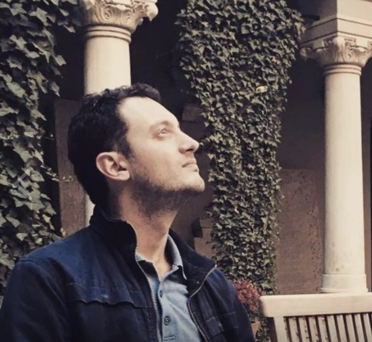

Sunt Razvan Visan, sunt un fost programator din Bucuresti care a pornit un startup, si profesional (vezi [profilul meu de LinkedIn](https://www.linkedin.com/in/razvanvisan/))
- am lucrat 12 ani la Bitdefender, in laboratoare
- am pornit acum 8 ani cu alti 2 co-fondatori un startup, Socialinsider, bootstrapped, SaaS, B2B, care a ajuns la o cifra de afaceri de $1M.

Si pe drum am primit foarte mult ajutor, gratis, aproape de fiecare data cand am avut nevoie si am intrebat. Am si facut foarte foarte multe greseli si din majoritatea sper ca am invatat.

Asa ca vreau sa ofer si eu mai departe, la fel cum am primit, adica tot gratis.

Am alocat 50 de ore in 2026 pentru a ajuta antreprenori romani, la inceput de drum, sau mai avansati.

Expertiza mea este in:
- tehnologie
- produs
- B2B
- vanzari online pe piata globala
- cum sa faci sa decoleze un proiect la inceput

La ce nu ma pricep:
- crypto
- B2C (jocuri, mobile apps)

Pentru a rezerva in calendarul meu un zoom call, te rog [aici](https://calendar.app.google/KpiVkn9825dJAQ469)

Mult succes!
